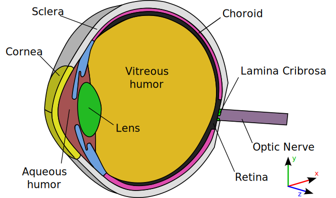

= A 3D geometrical model and meshing procedures for the human eyeball
:hide-uri-scheme:

Vincent Chabannes::
 Affiliation: Cemosis, IRMA UMR 7501, Université de Strasbourg, CNRS, France +
 Email: vincent.chabannes@cemosis.fr +
 Orcid: link:https://orcid.org/0009-0005-3602-3524[0009-0005-3602-3524]

Christophe Prud'homme::
 Affiliation: Cemosis, IRMA UMR 7501, Université de Strasbourg, CNRS, France +
 Email: christophe.prudhomme@cemosis.fr +
 Orcid: link:https://orcid.org/0000-0003-2287-2961[0000-0003-2287-2961]

Thomas Saigre::
 Affiliation: Cemosis, IRMA UMR 7501, Université de Strasbourg, CNRS, France +
 Email: thomas.saigre@math.unistra.fr +
 Orcid: link:https://orcid.org/0009-0009-5763-4956[0009-0009-5763-4956]

Lorenzo Sala::
 Affiliation: Université Paris-Saclay, INRAE, MaIAGE, 78350, Jouy-en-Josas, France +
 Email: lorenzo.sala@inrae.fr +
 Orcid: link:https://orcid.org/0000-0002-8878-0616[0000-0002-8878-0616]

Marcela Szopos::
 Affiliation: Université Paris Cité, CNRS, MAP5, F-75006 Paris, France +
 Email: marcela.szopos@u-paris.fr +
 Orcid: link:https://orcid.org/0000-0002-7300-3267[0000-0002-7300-3267]

Christophe Trophime::
 Affiliation: LNCMI, CNRS +
 Email: trophime@lncmi.cnrs.fr +
 Orcid: link:https://orcid.org/0000-0002-3147-5821[0000-0002-3147-5821]

This document describes the procedure to generate the geometry and the meshes of the 3D model of the human eyeball.
To generate the geometry and the meshes, the following tools are needed:

- Salome <<Ribes17>> (v9.12.0) https://www.salome-platform.org/,
- Feel++ <<Prudhomme24>> (0.111.0) https://docs.feelpp.org/home/index.html.

== Generate the geometry and the initial mesh

Generate the geometry of the human eyeball with the following command:

[source, bash]
----
salome [-t] construct-eye-STP.py [--geometrical_args...]
----

More details on the gemetrical arguments can be found in <<Sala24>>.

And generate the meshes with the following command:

[source, bash]
----
salome [-t] eye.py
----

To be utilized with Feel++, the mesh must be converted to the Gmsh format with the following command:

[source, bash]
----
gmsh -0 Eye_Mesh3D.med -o Eye_Mesh3D.msh
----

== Generate the uniform family mesh `M.`

To generate the uniform family mesh `M.`, run the following command:

[source, bash]
----
python3 generate_family.py
----

It will generate the meshes `M0`, `M1`, `M2`, `M3`, `M4` and `M5` of various refinement levels.

To east the usage of the meshed in parallel with Feel++, the meshes need to be partitionned.
This can be performed with the following command:

[source, bash]
----
./partition_mesh_M.sh
----

== Generate the adapted mesh `Mr`

The mesh `Mr` is generated by adapting `M` with a tinier refinement level around the aqueous humor part.
At this point, the pipeline to perform the mesh refinement with the tools of Feel++ is quite tricky, but the script `generate_Mr.sh` permit to do it:

[source, bash]
----
./generate_mesh_Mr.sh
----

== Generate the adapted family mesh `Mr.`

The adapted family mesh `Mr.` is generated by remeshing the mesh `Mr` with the following command:

[source, bash]
----
python3 generate_family.py Mr
----

== Partition the adapted family mesh `Mr.`

To partition the adapted family mesh `Mr.`, run the following command:

[source, bash]
----
./partition_mesh_Mr.sh
----

NOTE: With this partitionnement, the parts where the physics are considered are split: namely the `AqueousHumor` on the one hand where the coupled model is considered, and the remaining regions on the other hand, where the sole heat transfer is considered, see <<Saigre24>> for more details.

== Mesh description

.3D geometry of the human eyeball.

The markers of all the meshes are identical.

* The volume markers are: `"Cornea"`, `"Sclera"`, `"AqueousHumor"`, `"Lens"`, `"VitreousHumor"`, `"Iris"`, `"Lamina"`, `"Choroid"`, `"Retina"`, `"OpticNerve"`.
* The interfaces markers are defined when two volumes are in contact, and follow the convention `"Volume1_Volume2"`, where `"Volume1"` and `"Volume2"` are in lexicographic order. For example, the interface between the `"Cornea"` and the `"AqueousHumor"` is `"AqueousHumor_Cornea"`.
* The is one exception to the previous rule: the boudary surfaces around the lamina crobrosa are names `"Lamina_In"`, `"Lamina_Out"`, `Lamina_Lateral"` and `"Lamina_Hole"`.
* The external surfaces are: `"BC_Cornea"`, `"BC_Sclera"` and "`BC_OpticNerve`".

[bibliography]
== Bibliography

* [[Ribes17]] Alejandro Ribes, Adrien Bruneton, Anthony Geay. SALOME: an Open-Source simulation platform integrating ParaView. (2017) https://doi.org/10.13140/RG.2.2.12107.08485.
* [[Prudhomme24]] Christophe Prud'homme, Vincent Chabannes, Thomas Saigre, Christophe Trophime, Luca Berti, Abdoulaye Samaké, Céline Van Landeghem, et al. « Feelpp/feelpp: Feel++ Release V111 Preview.10 ». Zenodo, 15 juillet 2024. https://doi.org/10.5281/zenodo.12742155.
* [[Sala24]]  Sala L, Prud'homme C, Guidoboni G, Szopos M, Harris A. The ocular mathematical virtual simulator: A validated multiscale model for hemodynamics and biomechanics in the human eye. Int J Numer Meth Biomed Engng. 2024; 40(2):e3791. https://doi.org/10.1002/cnm.3791.
* [[Saigre24]] Thomas Saigre, Vincent Chabannes, Christophe Prud'homme, Marcela Szopos. A coupled model of heat transfer and fluid flow in the human eye. (2024). _In preparation_.